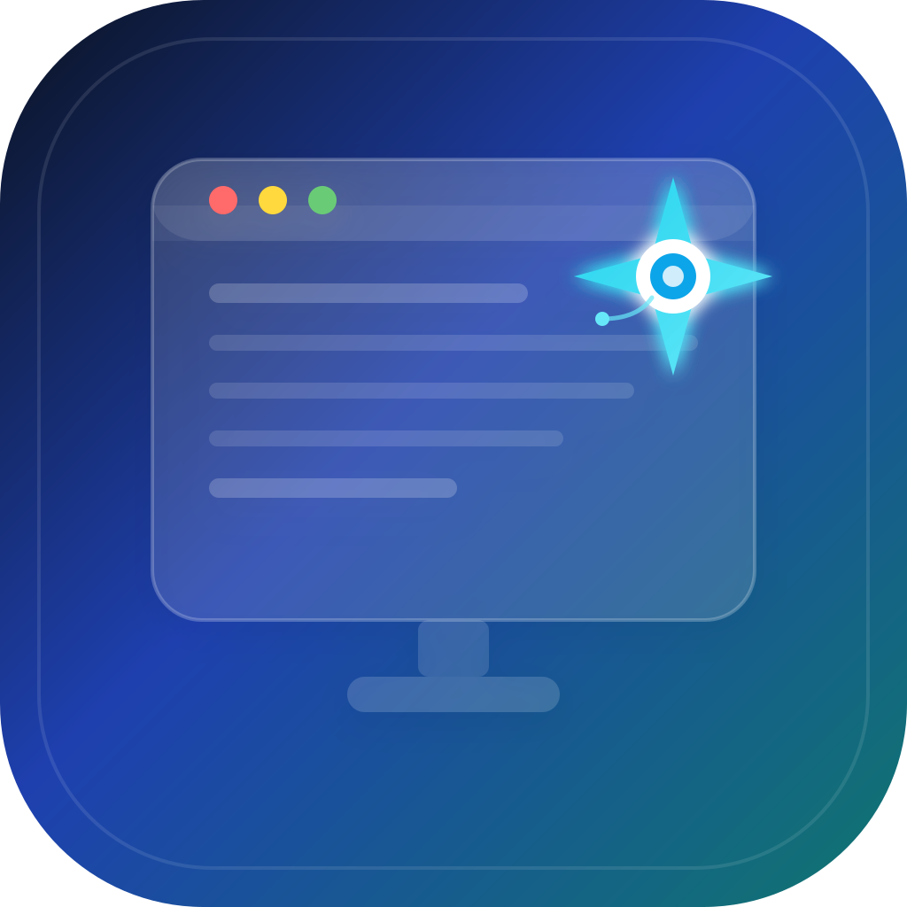
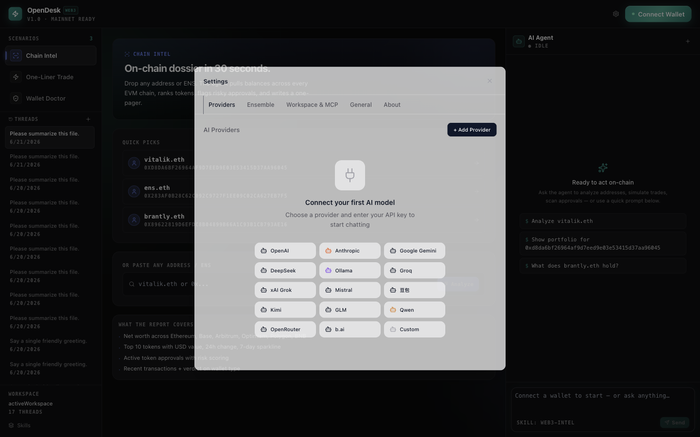
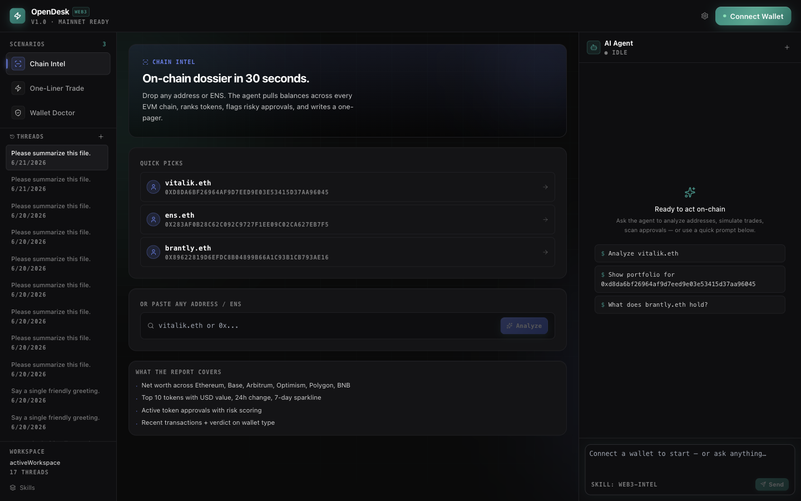
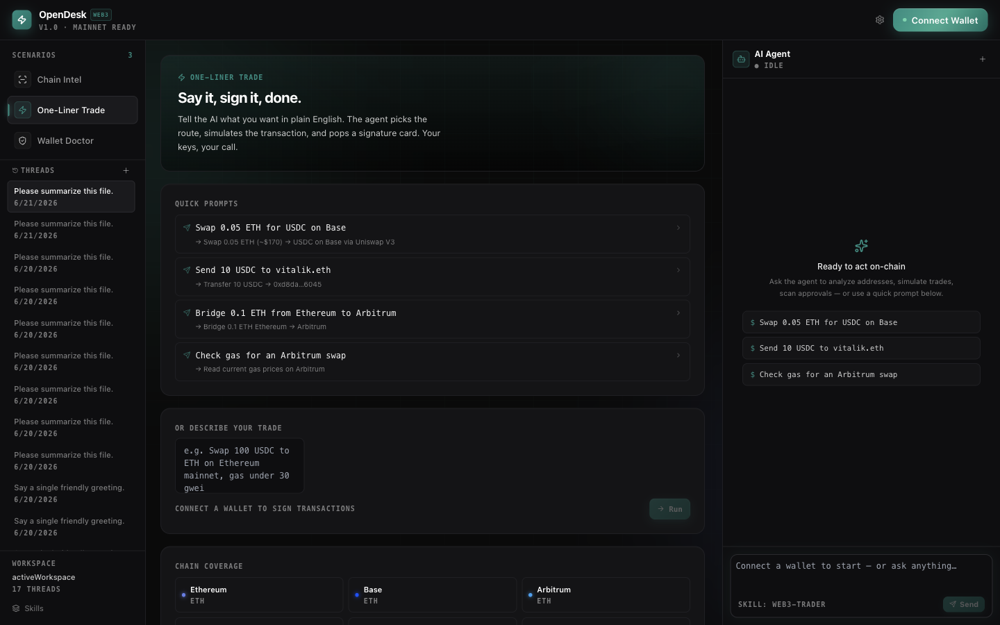
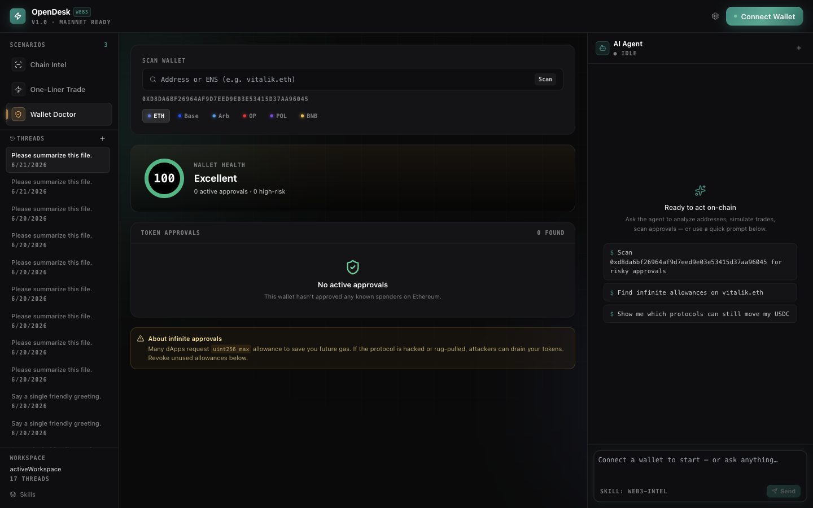
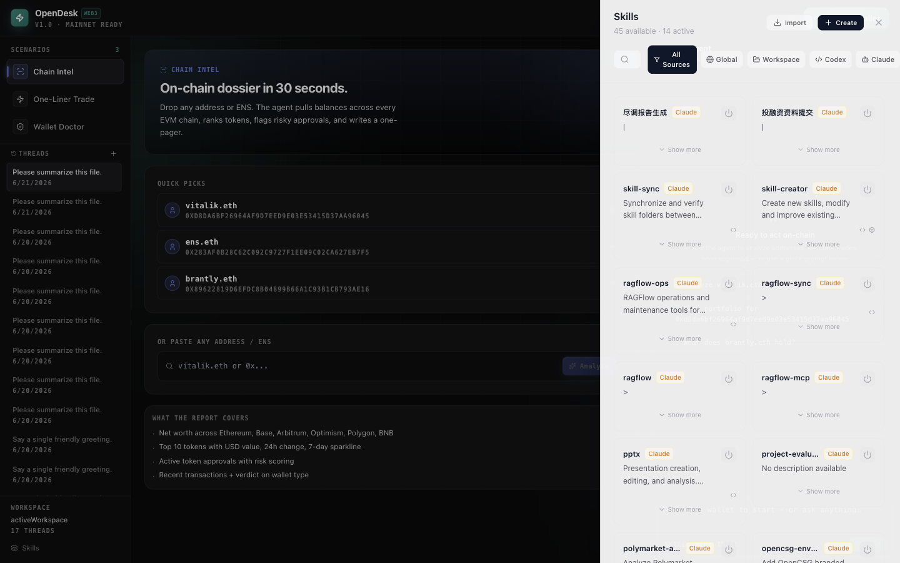

<div align="center">



# OpenDesk

> **AI 桌面助手，能跑任何模型、能用任何链、能接管你的桌面**

Model-agnostic · Web3 Workbench · Computer-Use capable · Folder-as-workspace · BYOK · Apache 2.0


[✨ 功能](#-核心功能) · [📸 截图](#-界面预览) · [🚀 快速开始](#-快速开始) · [📦 下载](#-下载) · [🔒 安全](#-安全与隐私)

__简体中文__ | [English](./README_EN.md)

---


</div>

## 📌 这是什么

OpenDesk 是一个**桌面端 AI 工作台**——把「跟 AI 对话」「管理加密钱包」「操控桌面」「写代码」这几件事装进同一个 Electron 应用里：

- 🧠 **多模型**：OpenAI / Anthropic / DeepSeek / Ollama / 任何 OpenAI 兼容端点，自带 BYOK 加密存储。
- ⛓️ **Web3 Workbench**：Reown AppKit + wagmi，扫码即连 300+ 钱包，原生支持 ENS、Etherscan 链上数据、Wallet Doctor 授权审计。
- 🖥️ **Computer Use**：`desktop_capture` / `desktop_click` / `desktop_type` —— 让 AI 真的能操作你的桌面。
- 🛠️ **Skills + MCP**：兼容 Claude Code / Codex 的 SKILL.md，可接入任意 MCP Server。
- 📁 **文件夹即工作区**：每个文件夹自动扫描 `AGENTS.md`，对话、文件、Skill 全部就位。

## 🧭 核心工作流：Plan → Confirm → Execute

跟 WorkBuddy / Manus / Claude Computer Use 同源设计 —— **AI 不是直接动你的文件，而是先把执行计划摆出来，你点头之后才动手**：

```
┌─────────────────────────────────────────────────────────────┐
│  1️⃣ Plan    AI 解析你的请求，拆出 N 个执行步骤并展示        │
│  2️⃣ Confirm 你在 Settings → Approval Mode 选自动/手动       │
│  3️⃣ Execute 工具调用实时显示在 Message 流里（哪个文件、     │
│              哪条命令、哪笔交易，灰底卡片 + 状态图标）        │
└─────────────────────────────────────────────────────────────┘
```

四种 Approval Mode（顶部工具栏 `ShieldAlert` 切换）：

| 模式 | 行为 | 适用场景 |
|------|------|---------|
| **Auto edits** | 文件改动自动通过；Shell / 桌面需手动 | 日常编码 / 写文档 |
| **Auto all** | 全部工具调用自动通过 | 信任场景 + 跑大批量任务 |
| **Bypass** | 完全跳过审批 | CI / 自动化脚本 |
| **Ask** | 任何改动都弹窗确认 | 处理陌生代码 / 高风险操作 |

每一笔 Web3 交易还会单独走 `TxConfirmCard`：金额、Gas、目标合约、风险等级 —— **不点 Confirm 不会发链上**。

## ✨ 核心功能

### 1. 🧠 多 Provider 管理

- **7 种 Provider 类型**：OpenAI · Anthropic · DeepSeek · Ollama · OpenAI-Compatible · Google · Generic
- **模型自动发现**：从 `/v1/models` 或 `/api/tags` 拉取可用列表
- **BYOK**：API Key 用 Electron `safeStorage` 加密，永不明文落盘
- **连接测试**：一键 ping 远端，状态绿/黄/红实时显示



### 2. ⛓️ Web3 Workbench（v0.5.0 新增）

- **Reown AppKit + wagmi**：300+ 钱包、WalletConnect v2、EIP-1193 原生支持
- **12 条主网 + 测试网**：Ethereum、Base、Arbitrum、Optimism、Polygon、BSC，全套 Sepolia 测试网
- **ENS 解析**：输入 `vitalik.eth` 自动解析地址
- **实时链上数据**：原生余额、Token 列表、最近活动（来自 Etherscan/Basescan/Arbiscan …）
- **Wallet Doctor**：扫描 ERC-20 `approve` 授权，标记无限授权、可疑合约
- **三大场景 Skill**：
  - `Chain Intel`：链上情报 + 巨鲸追踪
  - `One-Liner Trade`：自然语言下单（先 ENS，再 quote，再发送）
  - `Wallet Doctor`：批量撤销高风险授权

| Chain Intel | One-Liner Trade | Wallet Doctor |
|-------------|-----------------|---------------|
|  |  |  |

### 3. 🖥️ Computer Use（桌面真交互）

- **屏幕截图**：`desktop_capture` —— full / window / area
- **鼠标控制**：`desktop_click` —— 单击 / 双击 / 右键 / 指定坐标
- **键盘输入**：`desktop_type` 和 `desktop_key` —— 文本输入 + 组合键
- **窗口管理**：`desktop_windows` 列出，`desktop_activate` 切换
- **安全护栏**：Settings 里手动开启 `desktopEnabled`，未启用时一律拒绝

### 4. 🔌 MCP + Skills

- **完整 MCP 客户端**：JSON-RPC 2.0 over stdio，**不**依赖 `@anthropic-ai/mcp`
- **5 个预设 Server**：Filesystem、SQLite、Fetch、Slack、GitHub —— 一键添加
- **跨平台 Skills**：兼容 `.codex/skills` / `.claude/skills`，纯 Markdown 描述
- **6 个内置 Skill**：Code Reviewer · Doc Writer · Git Helper · Web3 Intel · Web3 Onboarder · Web3 Trader

### 5. 📁 文件夹即工作区

- **打开文件夹 = 创建 Workspace**：树形视图、Thread 分组、AGENTS.md 自动加载
- **持久化**：全部状态本地 SQLite 落盘，关闭重启不丢
- **附件**：拖文件到输入框，AI 自动读取并引用

## 📸 界面预览

| Onboarding（首次启动） | 主视图（Web3 Workbench） |
|------------------------|--------------------------|
|  |  |

| Chain Intel | One-Liner Trade |
|-------------|-----------------|
|  |  |

| Wallet Doctor | Settings — Providers |
|---------------|------------------------|
|  |  |

| Skills 面板（14 个内置 Skill，v0.6.0） |
|--------------------------------------|
|  |

## 🎯 典型使用场景

> **写给非技术读者**：下面 5 个场景把"AI 到底能帮我干哪些活"讲清楚。每一个都对应 OpenDesk 已经能跑的能力，不需要再装插件。

### 场景 1 — 电商运营：批量整理销售表

> 输入：`把桌面"2026Q1"下 12 个分店 Excel 汇总成一张总表，按区域排序，统计前三名`

OpenDesk 会自动：扫描文件夹 → 读每个 Excel → 合并数据 → 输出 `汇总_2026Q1.xlsx` + `TOP3区域.png` 柱状图。

### 场景 2 — 财务行政：票据识别自动报销表

> 输入：`把"~/Documents/发票/"下所有 PDF / 图片里的发票信息抽出来，生成可填的报销表`

调 **`ocr-invoice`** Skill（v0.6.0 内置）→ 自动 OCR 抽字段（金额/日期/抬头/税号）→ 输出 `报销表_2026Q1.xlsx`，所有抽出来的字段都可追溯到原始票据。

### 场景 3 — 销售运营：CRM 业绩智能洞察

> 输入：`分析"~/CRM/Q1.csv"，告诉我哪些客户本月可能流失、丢单原因分布、下月业绩预测`

调 **`sales-insight`** Skill（v0.6.0 内置）→ 自动跑 pandas 风格的统计分析 → 输出三段式洞察报告 + 3 张可视化图表。直接 paste 进周报。

### 场景 4 — 链上研究：陌生地址画像

> 输入：`查 0xd8da...6045 这个地址最近 30 天的链上活动，给我一份投资画像`

走 **Web3 Workbench → Chat** 场景：自动调用 Etherscan API → 抓交易/转账/Token 增减 → 总结「巨鲸/活跃交易者/被动 holder」三类画像。

### 场景 5 — 钱包体检：撤销高风险授权

> 打开 **Wallet Doctor**，选「Scan all approvals」

App 会列出所有 ERC-20 `approve` 记录，**用红色标出**「无限授权 + 不熟悉的合约」。点 `Revoke` 走 `TxConfirmCard` 二次确认 → 一键撤销。

### 场景 6 — 内容创作：一句生成完整 Word

> 输入：根据 `~/Notes/选题.md` 写一篇 2000 字公众号文章，标题要悬念式

OpenDesk 会读 Markdown → 让 AI 起草 → 调 `desktop_type` 把内容粘贴进 Pages/Word → 在右侧 Artifact 面板里渲染 HTML 预览，**一键导出 .docx**。

### 场景 7 — DevOps：异地紧急修代码

> 你在通勤路上，手机扫码连 Claw → 语音输入「`api/users.ts` 第 47 行有空指针，加个守卫」

桌面端 OpenDesk 收到远程指令 → 自动 Plan → Confirm（在手机上点 Yes）→ 执行 → 编译 → commit → 推 PR，全程不打断你坐地铁。  
*(远程控制 v0.6.0 上线，详见 Roadmap)*

### 场景 8 — 定时任务：每天 9 点自动跑日报

> 在 **自动化** 板块新建任务：cron `0 9 * * 1-5` + "跑昨天的 Sales 数据，生成日报发到 `~/Reports/`"

OpenDesk 后台按 cron 触发 → 自动跑 Skill → 把产物落到指定目录 → 可选"完成后通知"（系统通知 / Webhook / Telegram Bot）。  
*(v0.6.0 上线)*

## 🆚 OpenDesk vs 其他 AI 桌面助手

| 维度 | **OpenDesk** | WorkBuddy（腾讯云） | Claude Desktop | Cursor |
|------|--------------|---------------------|----------------|--------|
| 主要形态 | 桌面工作台（Electron） | 桌面 Agent（闭源） | 桌面 Chat | IDE |
| 模型 | BYOK 全开放 | 混元/DeepSeek/GLM/Kimi | 仅 Anthropic | OpenAI/Anthropic |
| Web3 原生 | ✅ wagmi + Reown + 12 链 | ❌ | ❌ | ❌ |
| 桌面真交互 | ✅ macOS/Win/Linux | ✅ 仅 Windows | ❌ | ❌ |
| 三大工作模式 | ✅ Ask/Plan/Craft（v0.6.0） | ✅ | ❌ | ❌ |
| 七大板块导航 | ✅ 助理/项目/专家/自动化/文件/知识库/灵感（v0.6.0） | ✅ | ❌ | ❌ |
| 多 Agent 并行 | ✅ Ensemble → Worker Pool（v0.6.0） | ✅ 多窗口 | ❌ | ❌ |
| 预设 Skill 数量 | 30+（v0.6.0 扩充） | 30+ | 数十 | 0 |
| 专家系统 | ✅ Skill 包装（v0.6.0） | ✅ 140+ 垂直专家 | ❌ | ❌ |
| 定时任务（自动化） | ✅ node-cron（v0.6.0） | ✅ | ❌ | ❌ |
| 多格式导出 | ✅ Word/Excel/PPT（v0.6.0） | ✅ | ⚠️ 仅 Markdown | ❌ |
| 文件夹即工作区 | ✅ + AGENTS.md | ✅ | ⚠️ 半成品 | ❌（项目即工作区） |
| MCP 客户端 | ✅ 自研，5 预设 | ✅ | ✅ | ❌ |
| 跨平台 Skill | ✅ `.codex/skills` / `.claude/skills` | ✅ OpenClaw | ✅ | ❌ |
| 本地优先 | ✅ SQLite 落盘 | ✅ 完全本地 | ⚠️ 部分 | ❌ |
| 远程控制 | ✅ Claw（v0.6.0） | ✅ 五大 IM | ❌ | ❌ |
| 开源 | ✅ Apache 2.0 | ❌ 闭源 | ❌ 闭源 | ❌ 闭源 |

## 🚀 快速开始

### 前置条件

- Node.js 18+
- npm 或 pnpm
- macOS 11+ / Windows 10+ / Linux (x86_64 或 arm64)

### 安装与启动

```bash
git clone https://github.com/frankfika/OpenDesk.git
cd opendesk
npm install        # 自动 patch viem/ox tempo KeyAuthorization
npm run dev        # 启动开发模式（Electron + 热重载）
```

### 第一次使用

1. 启动后看到 **Onboarding** 弹窗 —— 选择 Workspace（任意文件夹）和 AI Provider
2. 想要 Web3？点右上角 **Connect Wallet** → 扫码 / 选钱包 → 进入 Web3 Workbench
3. 想要 Computer Use？Settings → General → 启用 `desktopEnabled`

### 构建生产包

```bash
npm run build           # 编译 main / preload / renderer
npm run package         # electron-builder 打包（产物在 dist/）
```

## 📦 下载

> GitHub Release 由 `electron-builder` 自动发布到 `frankfika/OpenDesk`。

| 平台 | 架构 | 安装包 |
|------|------|--------|
| macOS | Apple Silicon (M1/M2/M3/M4) | `OpenDesk-0.5.0-arm64.dmg` |
| macOS | Intel | `OpenDesk-0.5.0-x64.dmg` |
| Windows | x64 | `OpenDesk-0.5.0-x64.exe` |
| Windows | arm64 | `OpenDesk-0.5.0-arm64.zip` |
| Linux | x64 | `OpenDesk-0.5.0-x64.AppImage` / `.deb` |

前往 [Releases 页面](https://github.com/frankfika/OpenDesk/releases) 下载预编译包。

## 🏗️ 项目结构

```
opendesk/
├── src/
│   ├── main/                    # Electron 主进程
│   │   ├── ipc/                 # IPC handlers（web3 / settings / workspace …）
│   │   ├── providers/           # AI provider 适配（OpenAI / Anthropic / Ollama …）
│   │   ├── tools/               # 内置工具（file / web3-tools / builtins）
│   │   ├── rag/                 # SQLite FTS5 + 类型化 adapter
│   │   └── persistence.ts       # better-sqlite3 持久化
│   ├── preload/                 # 暴露 window.api 的安全 IPC bridge
│   ├── renderer/                # React + Tailwind 前端
│   │   └── src/components/
│   │       ├── chat/            # ChatPanel / InputBar / Message / MentionPopover …
│   │       ├── settings/        # ProvidersPanel / EnsemblePanel / GeneralPanel …
│   │       ├── web3/            # Web3Workbench / PortfolioView / DoctorPanel …
│   │       └── layout/          # AppShell / LeftColumn / MiddleColumn
│   └── shared/                  # 跨进程类型
├── docs/                        # 产品文档 + 架构 + 截图
├── e2e/                         # Playwright + Electron e2e
├── scripts/
│   ├── capture-screenshots.mjs  # README 截图脚本（从真实运行应用捕获）
│   └── patch-ox-tempo.sh        # postinstall viem/ox 兼容补丁
└── resources/                   # 图标 / Logo
```

## 🧪 测试

```bash
npm test              # vitest 单元测试（95 用例）
npm run test:e2e      # Playwright + Electron 端到端（4 用例，含 3 个需要 DEEPSEEK_API_KEY 的）
npm run lint          # ESLint，0 warnings
```

三连验证（CI 必跑）：

```bash
npx tsc --noEmit -p tsconfig.node.json    # 主进程类型检查
npx tsc --noEmit -p tsconfig.web.json     # 渲染进程类型检查
npm run lint && npm test                  # lint + vitest
```

## 🔒 安全与隐私

- **Local First**：所有数据存本地（`userData` + SQLite），不联网同步
- **零遥测**：不收集任何使用统计
- **API Key 加密**：Electron `safeStorage`（macOS Keychain / Windows DPAPI / Linux libsecret）
- **Sandboxed Artifacts**：iframe `sandbox="allow-scripts"`，与主进程隔离
- **权限模型**：桌面操作需要用户在 Settings 里显式开启
- **Web3 谨慎发送**：所有链上交易都走 `TxConfirmCard` 二次确认，明示金额、Gas、目标合约

## 🛣️ 路线图

> 路线按"用户实际请求频次"排，不是按技术复杂度。优先级随社区反馈动态调整。
>
> **v0.6.0 全部是当前架构下 1–2 个 sprint 就能上的功能**——绝大多数参考自 WorkBuddy（腾讯云，2026-03）已验证的产品模式。

### 🚀 v0.6.0 — WorkBuddy 启发合集（核心增量）

| 模块 | 功能 | 实现路径 | 工期 |
|------|------|---------|------|
| **三大工作模式** | Ask / Plan / Craft 切换器放 TopBar | 复用现有 Approval Mode（4 档 → 3 档语义化） | 3 天 |
| **七大板块导航** | 助理 / 项目 / 专家 / 自动化 / 文件 / 知识库 / 灵感 | 在 LeftSidebar 加 segmented control | 2 天 |
| **多 Agent 并行** | 多个线程同时跑，进度条独立显示 | 扩展现有 Ensemble 模式，加 Worker Pool | 5 天 |
| **30+ 预设 Skill** | 内置从 6 个扩到 30+ | 写 24 个 `SKILL.md` 模板（含小红书运营、Excel 汇总、票据识别、销售洞察等） | 5 天 |
| **专家系统** | 包装 Skill 为"领域专家" | Skill + 固定 system prompt + 调用入口 | 3 天 |
| **多模态导出** | Artifacts 一键导出 Word / Excel / PPT | `docx` + `xlsx` + `pptxgenjs` | 4 天 |
| **定时任务（自动化）** | "每天 9 点自动跑日报" | `node-cron` + IPC + SQLite 持久化 | 4 天 |
| **侧边栏搜索 + 分组** | LeftColumn 顶部加 search box | 已存在的 Thread 列表升级 | 1 天 |
| **结果区（变更记录独立面板）** | 提取 tool call 到独立 panel | 抽离现有 Message 流 | 4 天 |
| **工作流沉淀** | Skill "Save as Template" 按钮 | 在 SkillPanel 加保存路径 | 2 天 |

**v0.6.0 总工时：≈ 5–6 周（一人全职）**

### 📦 v0.7.0 — 生产力跃升

- Claw 远程控制（v0.6.0 留技术债到 v0.7.0 集中做）
- RAG v2（BM25 + 向量混合检索 + rerank + 多模态 PDF 表格）
- 多格式导出 → 标准插件（任何 Skill 可注册自定义 exporter）
- Skills Marketplace 上线（GitHub-based 安装 `opendesk-skill-*`）

### 🌐 v0.8.0 — Web3 进阶

- 限价单 / DCA 定投 / 多签钱包
- 更多测试网（zkSync / Linea / Scroll）
- ENS 子域名管理

### 👥 v0.9.0 — 团队协作

- Workspace 共享 + 权限分级
- 多用户审计日志
- Skill Marketplace 评分 + 评论

### 🏢 v1.0.0 — 稳定 API + 插件市场 + 白标打包

- 公开插件 API（第三方扩展工具 / Skill / Provider）
- 白标打包（公司名 / Logo / 域名 / 主题色）
- 完整 SLA + 商业支持

## 🤝 贡献

欢迎 PR！请先读 `CONTRIBUTING.md`，开发流程：

```bash
npm run dev           # 开发模式
npm run lint:fix      # 自动修复可修的 lint 问题
npm run format        # Prettier
npm test              # 确保 95/95 通过
```

## 📬 社区

- GitHub Issues：[报告 Bug / 提需求](https://github.com/frankfika/OpenDesk/issues)
- GitHub Discussions：[技术讨论](https://github.com/frankfika/OpenDesk/discussions)

## 📜 License

Apache 2.0 —— 见 [LICENSE](./LICENSE)。

## 🙏 致谢

- [Electron](https://www.electronjs.org/) · [React](https://react.dev/) · [Zustand](https://github.com/pmndrs/zustand)
- [viem](https://viem.sh/) · [wagmi](https://wagmi.sh/) · [Reown AppKit](https://reown.com/appkit)
- [Tailwind CSS](https://tailwindcss.com/) · [Radix UI](https://www.radix-ui.com/) · [Framer Motion](https://www.framer.com/motion/)
- 灵感来源：[Claude Desktop](https://claude.ai/download) · [Codex](https://openai.com/index/openai-codex/) · [Kimi Work](https://kimi.moonshot.cn/) · [Trae](https://www.trae.ai/)

---

<div align="center">
Made with ❤️ by the OpenDesk team — since 2026
</div>
