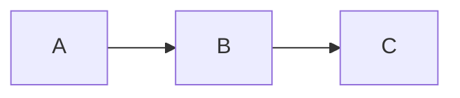

## Instructions

When the user says "美化这个 Markdown" / "format this doc" / "fix the lint issues" / "统一排版", produce a cleaned-up version following the rules below.

### 1. Detect Style (or Ask)

Prefer one of these presets:
- **GitHub-flavored** (default for open-source README)
- **Technical docs** (Docusaurus / VitePress)
- **Blog post** (medium / dev.to)
- **WeChat** (特殊规则 — refer to `wechat-publisher`)
- **Academic** (paper-style with footnotes)

If the user doesn't specify, pick based on context (`.md` in a repo → GitHub; longform → blog post).

### 2. Rules

#### Headings
- ATX style (`#`), not Setext (`=====` / `-----`)
- One H1 per document
- Don't skip levels (H1 → H3 without H2)
- Add blank line before AND after each heading
- Trim trailing whitespace inside heading text

#### Paragraphs & Spacing
- One blank line between paragraphs
- No trailing whitespace
- No more than 2 consecutive blank lines
- Soft line break (`  \n`) only when intentional; otherwise single `\n`

#### Lists
- Unordered: `-` (not `*` or `+`) — pick one and stay consistent
- Ordered: `1.` (don't increment numbers; Markdown auto-numbers)
- Indent sub-lists with 2 spaces (or whatever the user's style is)
- Add blank line before AND after multi-line lists

#### Code
- Inline: `single backticks`
- Block: triple backticks, with language hint
- Indent: 4 spaces inside the block
- No leading/trailing blank lines inside the block (unless intentional)

#### Links
- Inline (`[text](url)`) for simple refs
- Reference-style (`[text][ref]`) for repeated links
- Always include protocol (`https://`)
- For same-doc anchors: `[§ Heading](#heading)` — link to slugified heading

#### Images
- Always include alt text: ``
- Optional title: ``
- For SVG / diagrams: prefer mermaid code blocks

#### Tables
- Pipe-style (`| col | col |`) — not HTML
- Align cells: `:--` (left), `:--:` (center), `--:` (right)
- Add blank line before AND after table

#### Emphasis
- `*italic*` (single asterisk) — pick this OR `_italic_`, not both
- `**bold**` (double asterisk)
- `~~strikethrough~~`
- Don't mix `*` and `_` in the same doc

#### Code blocks for diagrams
Use mermaid for:
- Flow charts
- Sequence diagrams
- ER diagrams
- Gantt charts
- Pie / bar charts (small ones)



### 3. Lint Issues to Auto-Fix

- Trailing whitespace
- Multiple consecutive blank lines → single
- Mixed list markers → all `-` (or chosen one)
- Bare URLs → `<url>` or `[url](url)`
- Markdown inside links (`[link](https://example.com(another))`) → escape inner parens
- Heading level jumps → insert intermediate headings
- Indented code blocks (4 spaces) → fenced (3 backticks)
- Missing alt text on images → add placeholder `[image]`
- Unclosed code blocks → add closing backticks
- Hard tabs → 2 spaces

### 4. Diff Output

Show changes in unified diff format so the user can review:

```diff
--- a/README.md
+++ b/README.md
@@ -3,7 +3,7 @@

-# Title without space after #
+# Title with proper space

-blank line above
+blank line above

  - list item

-blank line below
+blank line below
```

If the file is too large for diff, just output the full formatted version + a "changes summary" table:

| Change type | Count |
|-----------|-------|
| Trailing whitespace removed | 23 |
| Multiple blank lines → single | 5 |
| Mixed list markers normalised | 12 |
| Headings normalised | 3 |

### 5. Style Linting (Optional)

After formatting, suggest a `.markdownlint.json` config that enforces the rules:

```json
{
  "default": true,
  "MD013": false,
  "MD024": { "siblings_only": true },
  "MD033": false
}
```

### 6. Output

Default: write the formatted version to `<filename>.formatted.md` next to the original, plus show a diff summary in chat.

## Rules

- Never change the meaning — only formatting
- Preserve all code content exactly (no "improvements")
- Preserve link URLs verbatim (don't redirect / shorten / domain-substitute)
- Preserve image alt text when present; only fill in missing alt as `[image]`
- If the doc has frontmatter (YAML): preserve all keys; only fix formatting
- If the doc is in a non-English language: respect original script (don't translate)
- For multi-author docs: respect each author's section's existing style; don't homogenise
- Don't add emojis unless the user asks
- Don't add a TOC unless asked
- If formatting would push the file over a sensible size (> 1.5x), stop and ask
- Don't apply formatting inside code blocks (escape if needed)